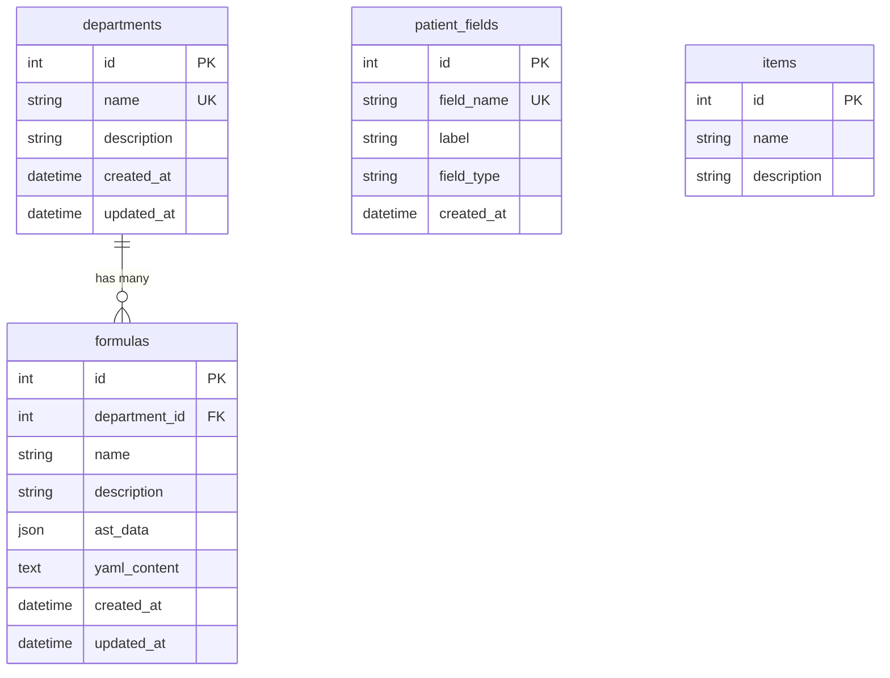

# Module Scoring - 醫療評分公式管理系統

AI 驅動的醫療評分公式管理平台，透過自然語言對話自動生成結構化 YAML 評分公式，並提供即時計算、風險評估與科別管理功能。

---

## 系統架構

```
Frontend (HTML/CSS/JS)
    |
FastAPI Backend
    ├── /api/v1  前端互動 API（科別、公式、病人欄位 CRUD）
    ├── /ai/v1   AI 任務 API（混合模式聊天 + 公式生成）
    |
    ├── Services Layer（業務邏輯）
    │   ├── AI Services（公式生成、YAML 解析、分數計算、風險評估）
    │   └── CRUD Services（科別、公式、病人欄位）
    |
    ├── Repositories Layer（資料存取）
    └── Database（SQLite / PostgreSQL / MySQL）
```

### 技術棧

| 層級     | 技術                                |
| -------- | ----------------------------------- |
| 後端框架 | FastAPI + Uvicorn                   |
| ORM      | SQLAlchemy 2.0                      |
| 資料庫   | SQLite（預設）/ PostgreSQL / MySQL  |
| AI 模型  | Google Gemini 2.5 Flash             |
| 前端     | 純 HTML / CSS / JavaScript          |
| 驗證     | Pydantic v2                         |
| 遷移     | Alembic                             |

### 資料庫 ER 圖



---

## 快速開始

### 1. 安裝依賴

```bash
pip install -r requirements.txt
```

### 2. 設定環境變數

建立 `.env` 檔案：

```env
GEMINI_API_KEY=your_gemini_api_key
DATABASE_URL=sqlite:///./app.db
AI_HEADER_KEY=changeme
GEMINI_MODEL=gemini-2.5-flash
ROOT_PATH=
```

### 3. 啟動服務

```bash
uvicorn app.main:app --host 127.0.0.1 --port 5000 --reload
```

前端介面：`http://127.0.0.1:5000/frontend/`

API 文件：`http://127.0.0.1:5000/docs`

---

## API 端點

### 前端互動 API (`/api/v1`)

| 方法     | 路徑                                       | 說明                   |
| -------- | ------------------------------------------ | ---------------------- |
| `POST`   | `/api/v1/departments`                      | 建立科別               |
| `GET`    | `/api/v1/departments`                      | 列出所有科別           |
| `GET`    | `/api/v1/departments/{id}`                 | 取得單一科別（含公式） |
| `PUT`    | `/api/v1/departments/{id}`                 | 更新科別               |
| `DELETE` | `/api/v1/departments/{id}`                 | 刪除科別               |
| `POST`   | `/api/v1/departments/{id}/formulas`        | 在科別下建立公式       |
| `GET`    | `/api/v1/formulas?department_id=`          | 列出所有公式           |
| `GET`    | `/api/v1/formulas/{id}`                    | 取得單一公式           |
| `PUT`    | `/api/v1/formulas/{id}`                    | 更新公式               |
| `DELETE` | `/api/v1/formulas/{id}`                    | 刪除公式               |
| `POST`   | `/api/v1/formulas/calculate`               | 計算分數與風險等級     |
| `POST`   | `/api/v1/formulas/extract-variables`       | 解析 YAML 萃取變數     |
| `POST`   | `/api/v1/formulas/convert-to-ast`          | YAML 轉 Blockly AST   |
| `GET`    | `/api/v1/patient-fields`                   | 列出所有病人欄位       |
| `POST`   | `/api/v1/patient-fields`                   | 登錄新病人欄位         |

### AI 任務 API (`/ai/v1`)

| 方法   | 路徑            | 說明                             |
| ------ | --------------- | -------------------------------- |
| `POST` | `/ai/v1/chat`   | 混合模式聊天（對話 + 公式生成）  |

> AI API 需在 Request Header 帶入 `X-AI-KEY` 認證。

---

## 前端功能

系統前端包含三個主要頁籤：

| 頁籤       | 功能                                                             |
| ---------- | ---------------------------------------------------------------- |
| AI Chat    | 與 AI 對話，自動偵測使用者意圖並生成評分公式，支援 YAML 預覽     |
| 科別管理   | 科別 CRUD，以卡片式呈現                                         |
| 公式管理   | 三欄式介面：公式列表 / YAML + AST 預覽 / 變數輸入 + 分數計算    |

---

## 專案結構

```
app/
  main.py                      # FastAPI 進入點
  common/                      # 共用例外、工具
  controllers/
    api_v1/                    # 前端互動 API
    ai_v1/                     # AI 任務 API
  infra/
    db.py                      # 資料庫連線
    settings.py                # 環境變數
    clients/gemini_client.py   # Gemini AI 客戶端
  models/                      # Pydantic Schema
  repositories/                # 資料存取層
  services/
    ai/                        # AI 相關服務
      formula_generator.py     # AI 公式生成
      yaml_parser.py           # YAML 解析驗證
      score_calculator.py      # 分數計算引擎
      risk_assessor.py         # 風險等級評估
      scoring_service.py       # AI 服務協調
frontend/
  index.html / style.css / app.js
tests/
alembic/
```

---

## YAML 評分公式規格

### 頂層結構

```yaml
score_name: <snake_case 分數名稱>
modules: <模組列表>
risk_levels: <風險等級列表>
```

### Modules（模組）

每個模組包含 **variables**、**formulas**、**rules** 三部分：

```yaml
modules:
  - name: <PascalCase 模組名>
    variables:
      <variable_name>: int | float | boolean
    formulas:
      - <公式定義>
    rules:
      - if: <條件>
        add: <數值>
```

### 公式類型

**Type 1 - 直接數學表達式**

```yaml
- name: base_clearance
  formula: ((140 - age) * weight) / (72 * serum_creatinine)
```

**Type 2 - 條件式 (conditions)**

```yaml
- name: age_factor
  conditions:
    - if: age > 80
      value: 3
    - if: age > 60
      value: 2
    - else:
      value: 1
```

> `formula` 欄位只能包含純數學表達式（變數、數字、`+` `-` `*` `/` 括號）。
> 任何 if/else 條件邏輯**必須**使用 `conditions` 區塊，禁止在 `formula` 中使用行內 if/else。

### Rules（評分規則）

定義公式結果如何累加到全域分數：

```yaml
rules:
  - if: age_factor >= 3
    add: 3
  - if: adjusted_clearance < 30
    add: 4
```

### Risk Levels（風險等級）

由上到下比對，最後一項必須是 `else`：

```yaml
risk_levels:
  - if: score >= 6
    text: 高風險 - 建議立即處置
  - if: score >= 3
    text: 中度風險 - 需追蹤觀察
  - else:
    text: 低風險 - 正常
```

### 條件語法

| 語法     | 範例                                                    |
| -------- | ------------------------------------------------------- |
| 比較     | `age > 80`, `score >= 12`, `weight == 60`               |
| 邏輯     | `age > 60 and is_female`, `has_chf or has_hypertension` |
| 布林變數 | `is_female`（直接判定 true/false）                      |

### 命名規則

| 項目                    | 格式         | 範例                            |
| ----------------------- | ------------ | ------------------------------- |
| score_name              | `snake_case` | `cha2ds2_vasc_stroke_risk`      |
| module name             | `PascalCase` | `Demographics`, `RenalFunction` |
| variable / formula name | `snake_case` | `age_factor`, `base_clearance`  |
| variable type           | -            | `int`, `float`, `boolean`       |

### 關鍵規則

1. 每個 module **必須有 `rules`**，否則公式不會貢獻到全域分數
2. `risk_levels` 最後一項**必須是 `else`**
3. 公式可交叉引用同模組或前面模組的公式名稱
4. `formula` 欄位禁止使用行內 if/else，所有條件邏輯一律用 `conditions` 區塊

### 完整範例

```yaml
score_name: cockcroft_gault_creatinine_clearance

modules:
  - name: Demographics
    variables:
      age: int
      is_female: boolean
    formulas:
      - name: age_factor
        conditions:
          - if: age > 80
            value: 3
          - if: age > 60
            value: 2
          - else:
            value: 1
      - name: gender_factor
        conditions:
          - if: is_female
            value: 0.85
          - else:
            value: 1
    rules:
      - if: age_factor >= 3
        add: 3
      - if: age_factor >= 2
        add: 1

  - name: RenalFunction
    variables:
      weight: float
      serum_creatinine: float
      age: int
    formulas:
      - name: base_clearance
        formula: ((140 - age) * weight) / (72 * serum_creatinine)
      - name: adjusted_clearance
        formula: base_clearance * gender_factor
    rules:
      - if: adjusted_clearance < 30
        add: 4
      - if: adjusted_clearance < 60
        add: 2

risk_levels:
  - if: score >= 6
    text: 高風險 - 嚴重腎功能不全，建議腎臟科會診
  - if: score >= 3
    text: 中度風險 - 需調整藥物劑量
  - else:
    text: 低風險 - 腎功能正常
```
